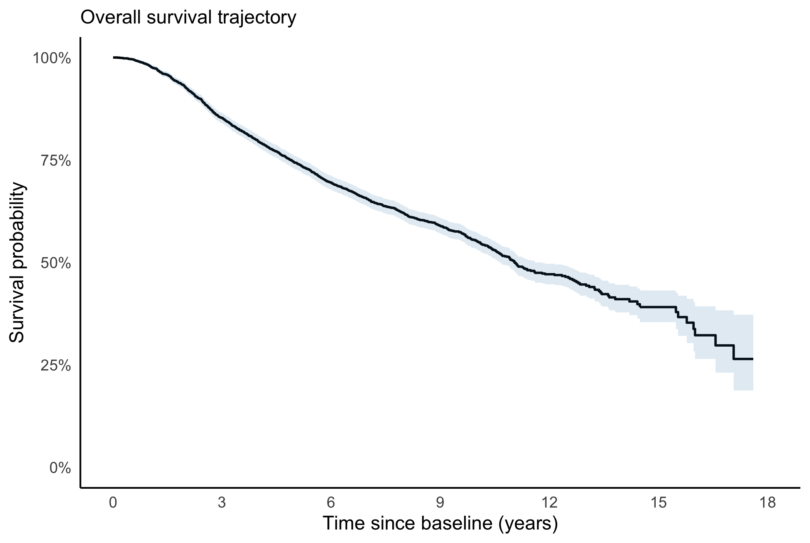
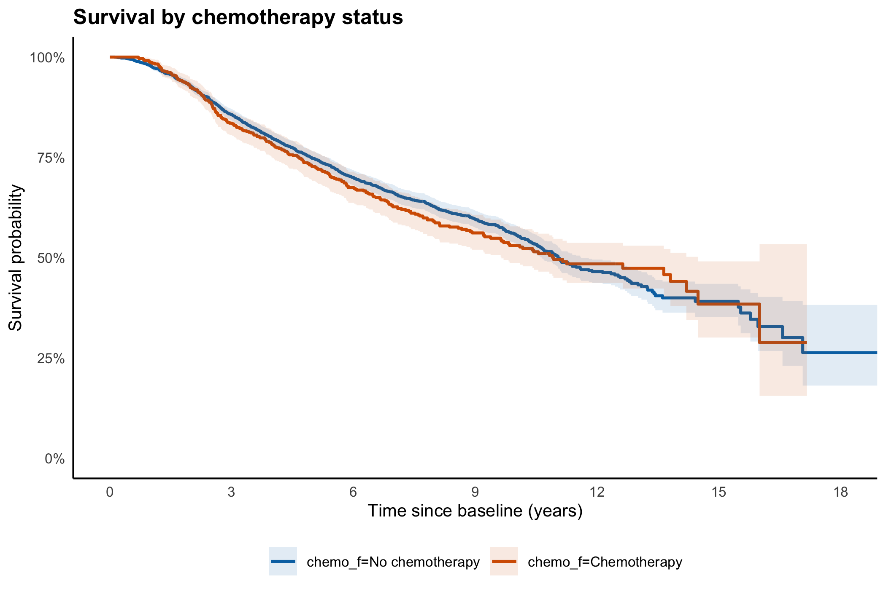

```{r}
#| label: report-setup
#| include: false

library(survival)
library(data.table)
library(ggplot2)
library(ggsurvfit)
library(gt)
library(scales)
library(here)

# Central project paths
source(
  here(
    "parameters",
    "directories.R"
  )
)

# analytical pipeline
source(
  here(
    "R",
    "01_data-preparation.R"
  )
)

source(
  here(
    "R",
    "02_stage1-analysis.R"
  )
)

source(
  here(
    "R",
    "03_stage2-analysis.R"
  )
)

# ------------------------------------------------------------
# Stage 2 presentation objects
# ------------------------------------------------------------

landmark_rows_html <- paste0(
  '<div class="landmark-mini-row">',
  '<div>',
  km_chemo_dt$Landmark,
  '</div>',
  '<div>',
  km_chemo_dt$Chemotherapy,
  '</div>',
  '<div>',
  km_chemo_dt[["No chemotherapy"]],
  '</div>',
  '</div>',
  collapse = "\n"
)
```

<!-- COVER PAGE -->

<section class="report-page cover-page">

<div class="cover-band"></div> <!-- this is for the strip on the left-most corner of the cover of the report -->
<div class="cover-accent"></div>

<div class="cover-inner">
<div class="cover-kicker">Portfolio research report</div>

<h1>Breast Cancer Survival in the Rotterdam Tumor Bank</h1>

<div class="cover-sub">
Prognostic factors, treatment selection, and survival outcomes
</div>

<div class="cover-meta">
<div class="label">Author</div>
<div class="value"><strong>Rabbi Tweneboah</strong></div>

<div class="label">Focus</div>
<div class="value">Epidemiological methods · Survival analysis · Public health</div>

<div class="label">Tools</div>
<div class="value">R · Quarto · HTML+CSS</div>

<div class="label">Current scope</div>
<div class="value">Stage 1–2 results</div>
</div>

<div class="cover-note">
Reproducible research portfolio
</div>
</div>
</section>


<!-- =========================================================
EXECUTIVE SUMMARY
========================================================= -->

<section class="report-page summary-page">
<div class="summary-inner">

<!-- Page heading -->
<div class="summary-top">
<div>
<div class="summary-kicker">Executive summary</div>
<h1 class="summary-title">What the analysis shows so far</h1>
</div>
<div class="summary-tag">Stage 1–2</div>
</div>

<!-- Opening summary -->
<div class="summary-lead">
This study uses the Rotterdam Tumor Bank cohort to examine overall survival among women with primary breast cancer, with particular attention to treatment selection and the observed survival experience of women who did and did not receive chemotherapy.
</div>

<!-- Headline metrics -->
<div class="metric-grid">

<div class="metric-card">
<div class="metric-number">`r format(stage1_metrics$n_patients, big.mark = ",")`</div>
<div class="metric-label">women in the analytic cohort</div>
</div>

<div class="metric-card">
<div class="metric-number">`r sprintf("%.2f", followup$median)`</div>
<div class="metric-label">years median potential follow-up</div>
</div>

<div class="metric-card">
<div class="metric-number">`r sprintf("%.2f", km_overall$median)`</div>
<div class="metric-label">years median overall survival</div>
</div>

<div class="metric-card">
<div class="metric-number">`r sprintf("%.3f", logrank_p)`</div>
<div class="metric-label">log-rank p-value for crude chemotherapy comparison</div>
</div>

</div>

<!-- Findings + interpretation -->
<div class="summary-columns">

<div class="summary-findings">
<h2>Key findings</h2>
<ul>
<li>Five-year overall survival was approximately <strong>`r scales::percent(over_surv$surv5, accuracy = 0.1)`</strong>, declining to <strong>`r scales::percent(over_surv$surv10, accuracy = 0.1)`</strong> at 10 years and <strong>`r scales::percent(over_surv$surv15, accuracy = 0.1)`</strong> at 15 years.</li>
<li>Women receiving chemotherapy were substantially different from untreated women at baseline, particularly with respect to age, menopausal status, lymph-node involvement, and estrogen-receptor levels.</li>
<li>Crude Kaplan–Meier survival was broadly similar across chemotherapy groups; the log-rank test did not identify a statistically significant difference (<strong>p = `r sprintf("%.3f", logrank_p)`</strong>).</li>
<li>The large baseline imbalances mean that crude treatment-group comparisons should not be interpreted as causal treatment effects.</li>
</ul>
</div>

<div class="interpretation-box">
<div class="interpretation-label">Interpretation</div>
<div class="interpretation-title">Current results indicates treatment selection problem, not treatment effectiveness.</div>
<div class="interpretation-text">
Chemotherapy was not randomly assigned. Stage 3 should therefore focus on covariate-adjusted survival modelling and the extent to which the crude chemotherapy–survival association changes after adjustment.
</div>
</div>

</div>

<!-- Reader-oriented report structure -->
<div class="structure-section">
<div class="summary-rule"></div>
<h2>Reader-oriented report structure</h2>

<div class="structure-table">

<div class="structure-header">
<div>Section</div>
<div>Purpose</div>
</div>

<div class="structure-row">
<div>1. Study context</div>
<div>Why treatment selection matters in observational breast-cancer survival data</div>
</div>

<div class="structure-row">
<div>2. Cohort and treatment selection</div>
<div>Who is represented and how chemotherapy groups differ at baseline</div>
</div>

<div class="structure-row">
<div>3. Non-parametric survival analysis</div>
<div>Overall and chemotherapy-stratified Kaplan–Meier estimates</div>
</div>

<div class="structure-row">
<div>4. Multivariable modelling</div>
<div>Cox regression and the adjusted chemotherapy–survival association</div>
</div>

<div class="structure-row">
<div>5. Robustness and discussion</div>
<div>Model assumptions, sensitivity analyses, interpretation, and limitations</div>
</div>

</div>
</div>

</div>
</section>

<!-- =========================================================
STAGE 1 — COHORT CHARACTERIZATION
========================================================= -->

<section class="report-page stage1-page">
<div class="stage-inner">

<!-- Stage navigation -->
<div class="stage-nav">
<div class="stage-pill active">Stage 1</div>
<div class="stage-pill">Stage 2</div>
<div class="stage-pill">Stage 3</div>
<div class="stage-pill">Stage 4</div>
</div>

<!-- Heading -->
<div class="stage-kicker">Cohort characterization and treatment selection</div>

<h1 class="stage-title">Baseline risk differs substantially by chemotherapy status</h1>

<!-- Main two-column body -->
<div class="stage1-grid">

<div class="stage1-left">

<div class="stage-intro">
Before comparing survival outcomes, the analysis evaluates whether women who received chemotherapy were comparable with those who did not. Standardized mean differences (SMDs) show pronounced baseline imbalance in several clinically relevant characteristics.
</div>

<h2 class="stage-subtitle">Selected baseline characteristics</h2>

<div class="baseline-mini-table">

<div class="baseline-mini-header">
<div>Characteristic</div>
<div>No chemotherapy</div>
<div>Chemotherapy</div>
</div>

`r paste0(
  '<div class="baseline-mini-row"><div>',
  stage1_selected$Characteristic,
  '</div><div>',
  stage1_selected$No_chemo,
  '</div><div>',
  stage1_selected$Chemo,
  '</div></div>',
  collapse = "\n"
)`

</div>

<div class="stage-callout">
<div class="callout-label">Why it matters</div>
<div class="callout-text">
The chemotherapy group is younger but has greater lymph-node involvement and somewhat larger tumours. These differences are consistent with non-random treatment allocation and motivate covariate adjustment in later modelling.
</div>
</div>

</div>

<div class="stage1-right">

<h2 class="stage-subtitle imbalance-heading">Magnitude of baseline imbalance</h2>

<div class="imbalance-display">

`r paste0(
  '<div class="imbalance-row">',
  '<div class="imbalance-name">',
  stage1_imbalance$label,
  '</div>',
  '<div class="imbalance-track">',
  '<div class="imbalance-fill" style="width:',
  sprintf("%.1f", stage1_imbalance$bar_pct),
  '%;"></div>',
  '</div>',
  '<div class="imbalance-value">',
  sprintf("%.3f", stage1_imbalance$abs_smd),
  '</div>',
  '</div>',
  collapse = "\n"
)`

</div>

<div class="imbalance-note">
Absolute SMDs summarize covariate imbalance; values above 0.10 indicate potentially meaningful imbalance. Bar lengths use a common scale from 0 to 1.25.
</div>

<div class="allocation-card">
<div class="allocation-label">Treatment allocation</div>
<div class="allocation-number">`r scales::percent(stage1_metrics$prop_chemo, accuracy = 0.1)`</div>
<div class="allocation-text">of the cohort received chemotherapy (`r format(stage1_metrics$n_chemo, big.mark = ",")` of `r format(stage1_metrics$n_patients, big.mark = ",")` women)</div>
</div>

<div class="stage-callout reporting-callout">
<div class="callout-label">Confounding risk</div>
<div class="callout-text">
Treatment allocation is strongly associated with several prognostic characteristics. This creates substantial potential for confounding by treatment selection, making crude chemotherapy–survival comparisons insufficient for treatment-effect interpretation.
</div>
</div>

</div>

</section>


<!-- =========================================================
STAGE 2 — NON-PARAMETRIC SURVIVAL ANALYSIS
========================================================= -->

<section class="report-page stage2-page">
<div class="stage-inner">

<!-- Stage navigation -->
<div class="stage-nav">
<div class="stage-pill">Stage 1</div>
<div class="stage-pill active">Stage 2</div>
<div class="stage-pill">Stage 3</div>
<div class="stage-pill">Stage 4</div>
</div>

<!-- Heading -->
<div class="stage-kicker">Non-parametric survival analysis</div>

<h1 class="stage-title">Observed survival before covariate adjustment</h1>

<div class="stage2-introduction">
Kaplan–Meier estimation describes the cohort's observed survival experience without imposing a parametric survival distribution. Landmark estimates provide an accessible summary of survival over follow-up, while treatment-stratified curves describe crude differences between chemotherapy groups.
</div>

<!-- Overall survival metrics -->
<div class="metric-grid">

<div class="metric-card">
<div class="metric-number">`r scales::percent(over_surv$surv1, accuracy = 0.1)`</div>
<div class="metric-label">1-year survival</div>
</div>

<div class="metric-card">
<div class="metric-number">`r scales::percent(over_surv$surv5, accuracy = 0.1)`</div>
<div class="metric-label">5-year survival</div>
</div>

<div class="metric-card">
<div class="metric-number">`r scales::percent(over_surv$surv10, accuracy = 0.1)`</div>
<div class="metric-label">10-year survival</div>
</div>

<div class="metric-card">
<div class="metric-number">`r scales::percent(over_surv$surv15, accuracy = 0.1)`</div>
<div class="metric-label">15-year survival</div>
</div>

</div>

<!-- Main two-column layout -->
<div class="stage2-grid">

<!-- LEFT COLUMN -->
<div class="stage2-left">

<h2 class="stage-subtitle">Overall survival trajectory</h2>

<div class="km-figure1">

</div>

<h2 class="stage-subtitle stage2-second-heading">Survival by chemotherapy status</h2>

<div class="km-figure2">

</div>

<div class="stage-callout stage2-curve-callout">
<div class="callout-label">What the curves show</div>
<div class="callout-text">
The chemotherapy-stratified survival curves overlap substantially across follow-up, with no clear or sustained separation. The curves converge and cross later in follow-up, while uncertainty increases as fewer women remain under observation.
</div>
</div>

</div>

<!-- RIGHT COLUMN -->
<div class="stage2-right">

<h2 class="stage-subtitle">Crude survival by treatment group</h2>

<div class="landmark-mini-table">

<div class="landmark-mini-header">
<div>Landmark</div>
<div>Chemotherapy</div>
<div>No chemotherapy</div>
</div>

`r landmark_rows_html`

</div>

<div class="logrank-card">
<div class="logrank-label">Crude chemotherapy comparison</div>
<div class="logrank-number">p = `r sprintf("%.3f", logrank_p)`</div>
<div class="logrank-text">
Log-rank test comparing the unadjusted survival distributions
</div>
</div>

<div class="stage-callout stage2-interpretation">
<div class="callout-label">Interpretation</div>
<div class="callout-text">
The log-rank test does not provide evidence of a difference in the unadjusted survival distributions. This does not establish equivalence between treatment groups and should not be interpreted as evidence that chemotherapy has no effect.
</div>
</div>

</div>

</div>

</section>


